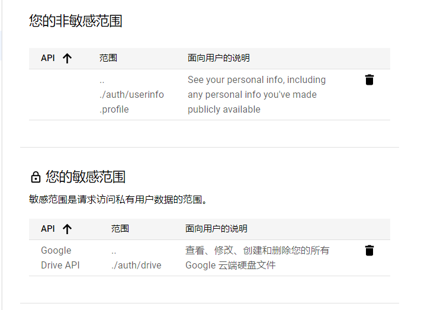

访问 [https://console.developers.google.com/](https://console.developers.google.com/)，新建一个项目。

选择 "信息中心" 中的 "启用 API 和服务"，搜索 "Google Drive API"，选中后点击 "启用"。

启用后回到首页，选择 "OAuth 同意屏幕"。

`User Type` 选择 "外部"，然后点击创建；填写所有必填项之后点击 "保存并继续"。

接下来选择 "添加或移除范围"， 添加 `https://www.googleapis.com/auth/drive` 和 `https://www.googleapis.com/auth/userinfo.profile` 两个 `OAuth Scope`，结果应该如下图所示

然后点击 "保存并继续"。

~~在 "测试用户" 中添加你的 Google 账号。由于我们并不会发布这个应用，所以需要添加自己为测试用户。~~

测试状态的应用的 refresh token 有效期只有 7 天，所以我们需要发布这个应用。

在“发布状态”中，将应用发布，但不进行验证。

然后在首页选择 "凭据" -> "创建凭据" -> "OAuth 客户端 ID"。

应用类型选择 "Web 应用"；"已获授权的重定向 URI" 填写 `https://go-drive.top/oauth_callback`，这个链接是一个静态的 HTML 页面，代码在 https://github.com/devld/go-drive/blob/master/docs/oauth_callback.html

点击 "创建"。

将弹出框中的 "客户端 ID" 和 "客户端密钥" 保存备用。

最后，在 GoDrive 中添加即可。