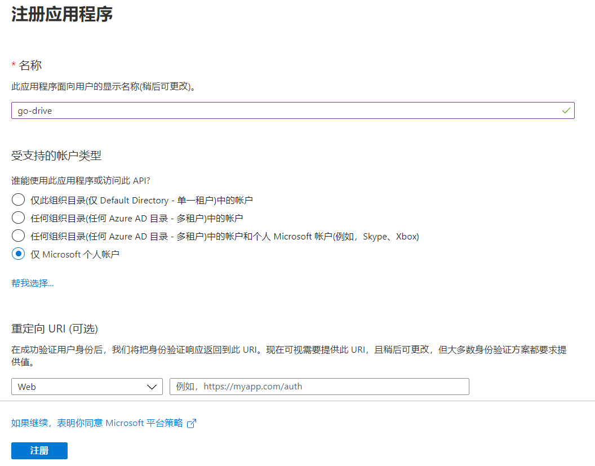
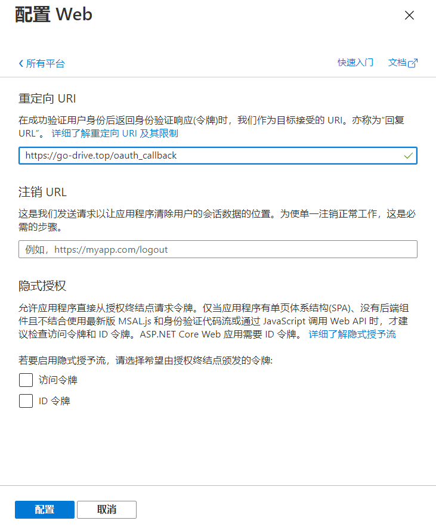
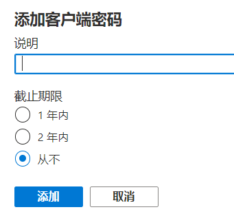
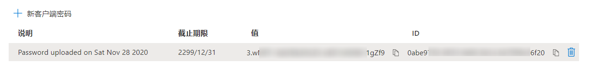
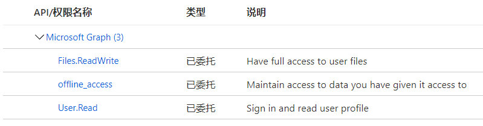

## 注册应用

访问 [https://portal.azure.com/](https://portal.azure.com/)（如果是世纪互联版的 OneDrive，请访问 [https://portal.azure.cn/](https://portal.azure.cn/)），首先登录你的 Microsoft 账户。

在页面左侧的菜单中选择 "Azure Active Directory"。

在打开的页面下方找到 "创建" -> "应用注册"。

按照上图填写表单。

- **名称**: 应用的名称，可随意填写
- **受支持的账户类型**: 支持的 Microsoft 账户类型，按照需绑定的账号类型选择
- **重定向 URI**: 用于 OAuth2 的回调 URL，暂时先不填写

接下来，点击 "注册"。

## 配置应用

在上一步创建的应用界面左侧，找到 "身份验证" -> "平台配置"，选择 "添加平台"。

在右侧选择 "Web" 。

此处的重定向 `URI` 可以填写 `https://go-drive.top/oauth_callback`. 这个链接是一个静态的 HTML 页面，代码在 https://github.com/devld/go-drive/blob/master/docs/oauth_callback.html

接下来在左侧找到 "证书和密码"，添加 "客户端密码"。

创建完成后，**将 `值` 保存备用**，值即为 `Client Secret`。

在页面左侧找到 "API 权限"，添加权限。

选择 "常用 Microsoft API" 下的 "Microsoft Graph"，然后选择 "委托的权限"，应用需要三种权限：

- `User.Read`: 读取用户的基本信息
- `Files.ReadWrite`: 读写 OneDrive 的任何文件
- `offline_access`: 这个权限用于登录成功后获取 `Refresh Token`，保持登录状态

> **注意，如果需要将文件存放在 SharePoint 站点中，则需要将 `Files.ReadWrite` 更换为 `Files.ReadWrite.All`**

添加完成后，应该如下图所示

## 添加 OneDrive

接下来在 GoDrive 添加即可。

`Client Id` 为注册的应用的 `应用程序(客户端) ID`，可在上一步的配置页面中的 "概述" 找到。

`Client Secret` 为上一步中复制的证书和密码中的 "值"。

