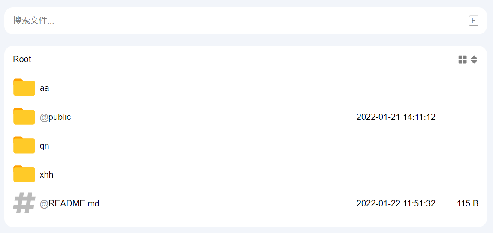
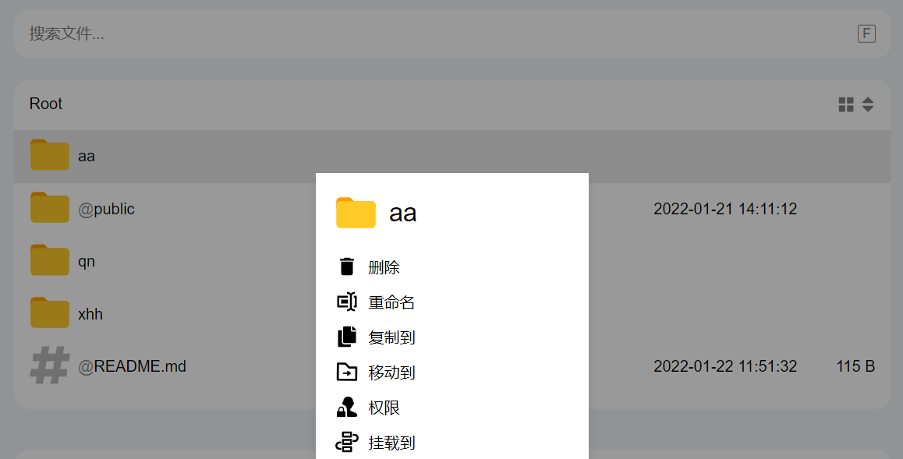
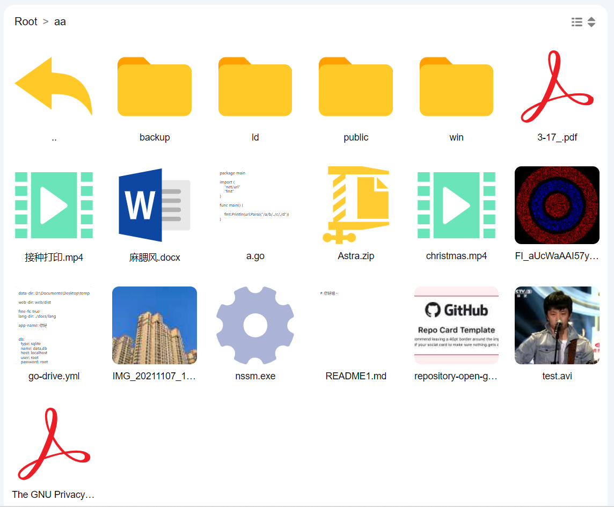
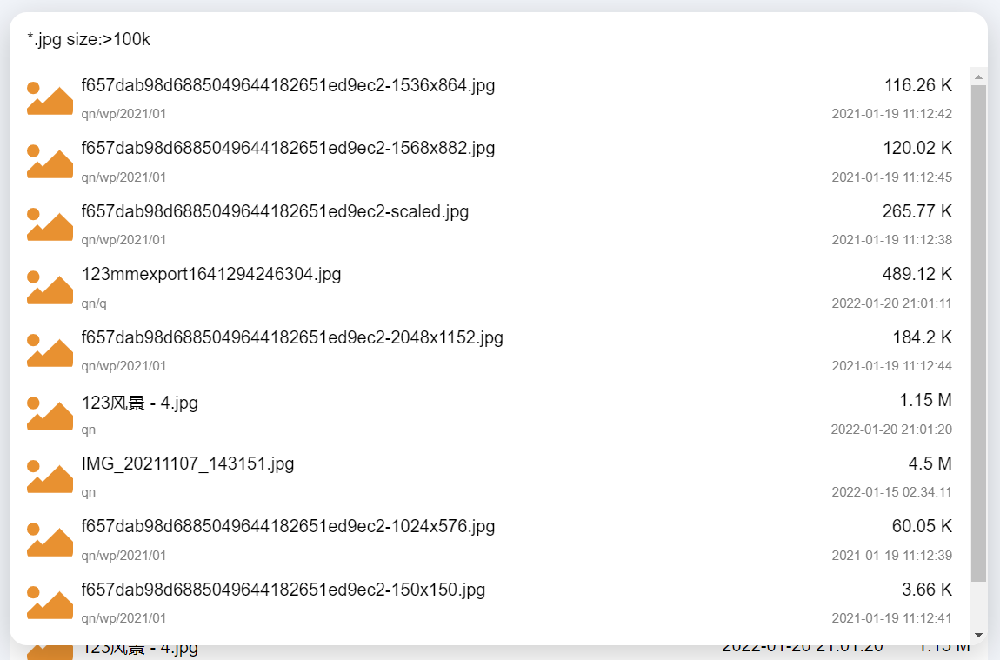
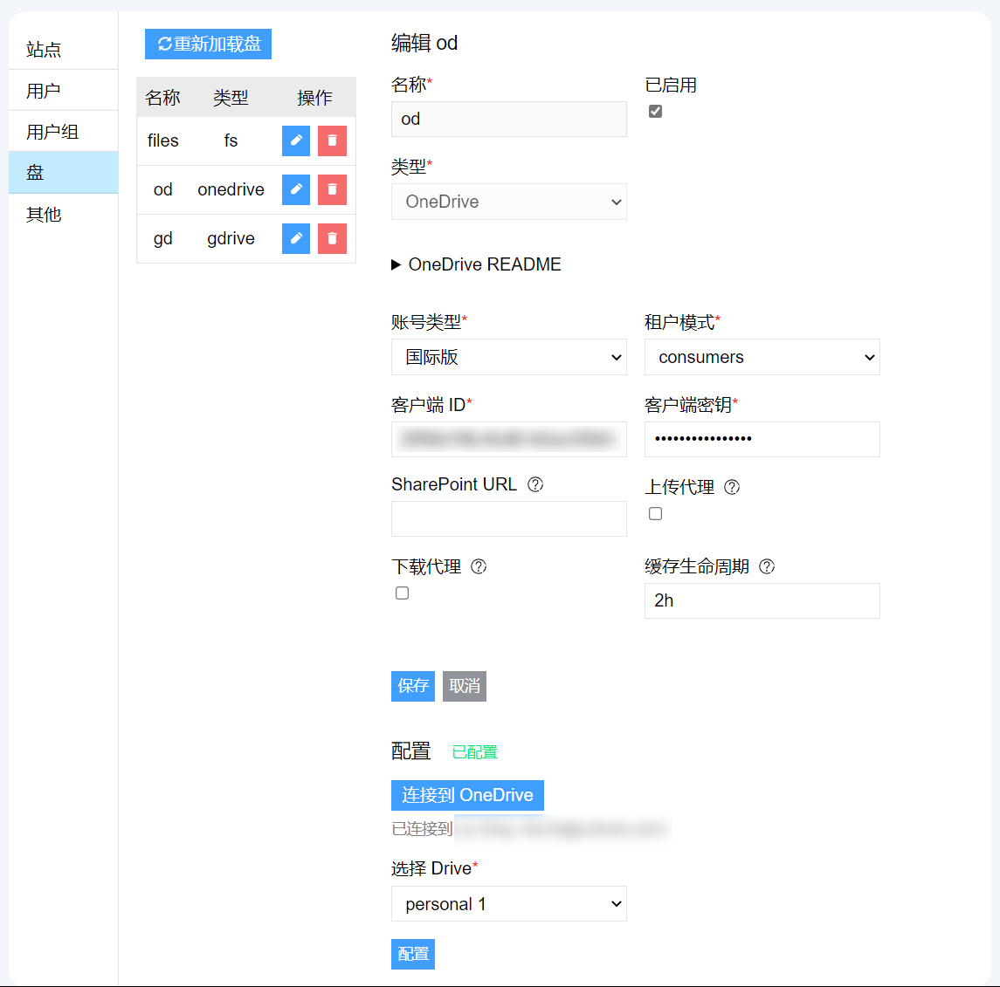
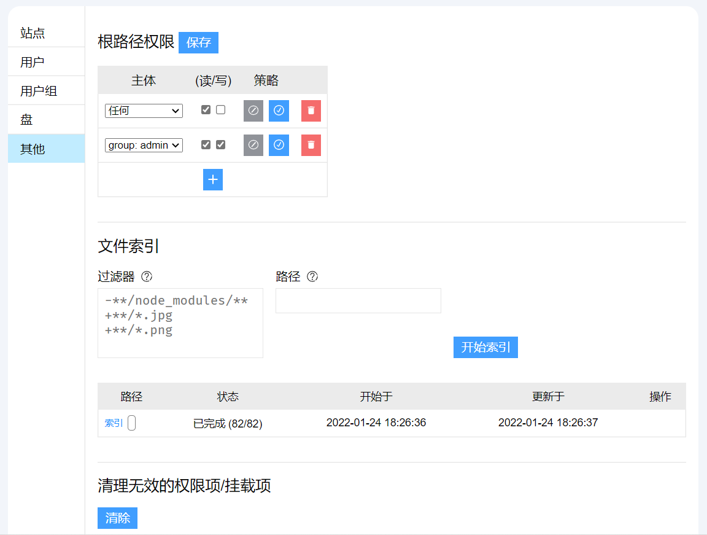

- [Features](#features)
  - [目前支持的云存储](#目前支持的云存储)
  - [功能](#功能)
  - [截图](#截图)
- [运行](#运行)
  - [直接运行](#直接运行)
  - [使用 Docker 运行](#使用-docker-运行)
  - [手动构建](#手动构建)
- [开始使用](#开始使用)
  - [添加云存储映射](#添加云存储映射)
    - [本地文件](#本地文件)
    - [FTP](#ftp)
    - [SFTP](#sftp)
    - [WebDAV](#webdav)
    - [S3](#s3)
    - [OneDrive](#onedrive)
    - [Google Drive](#google-drive)
  - [权限相关](#权限相关)
  - [路径挂载](#路径挂载)
  - [文件搜索](#文件搜索)
  - [通过 WebDAV 访问](#通过-webdav-访问)
- [FAQ](#faq)
  - [新建或编辑盘并保存后没生效？](#新建或编辑盘并保存后没生效)
  - [如何使用 Nginx 反向代理 go-drive？](#如何使用-nginx-反向代理-go-drive)
  - [创建“本地文件”类型的映射时，显示“路径不存在”](#创建本地文件类型的映射时显示路径不存在)
- [参考](#参考)
  - [配置文件](#配置文件)
  - [命令行参数](#命令行参数)

## Features

### 目前支持的云存储

- 本地文件系统
- FTP
- SFTP
- WebDAV
- S3
- OneDrive (支持世纪互联版及 SharePoint 站点)
- Google Drive

### 功能

- 基本的文件管理

  - 上传，下载，复制，移动，重命名，删除
  - 支持不经过服务器上传及下载，减少服务器流量消耗（仅部分云存储支持，详见下文）
  - 断点续传

- 基于用户/组的读/写权限控制

  支持为某目录或文件分配权限，支持限制到用户或组

- WebDAV 访问

  从 WebDAV 客户端访问云存储文件

- 图片浏览（使用 [PhotoSwipe](https://photoswipe.com/)）

  - 支持缩略图模式浏览
  - 支持可配置的缩略图生成器

- 文件编辑（使用 [CodeMirror](https://codemirror.net/)）

- 路径挂载

  - 允许管理员将某文件/目录挂载到任意位置

- Web 管理界面，添加/删除云储存映射

- 文件搜索（使用 [Bleve](http://blevesearch.com/)）

- 暗色模式/适配移动端


### 截图

- 主页



- 文件菜单



- 缩略图模式



- 搜索面板



- 盘管理面板



- 其他管理项



## 运行

### 直接运行

从 [Releases](https://github.com/devld/go-drive/releases) 页面下载适用于你的平台的包，解压后直接运行即可。


预先编译的平台有：

- Linux `amd64/arm/arm64`
- Linux `musl` `amd64/arm/arm64`  (适用于使用 `musl libc` 的发行版，如 Alpine, 软路由等)
- Windows amd64


> 请注意：go-drive 的数据文件默认存放在`当前运行目录`，如需指定为其他目录，请修改 `config.yml` 中的 `data-dir` 配置项


详细的配置，请参考 [配置文件](#配置文件)。


### 使用 Docker 运行

> 目前只构建了 `amd64` 的 Docker 镜像


为了在升级时保留数据，需要将数据目录映射到容器外。

```bash
mkdir go-drive-data
docker run -d --name go-drive -p 8089:8089 -v $(pwd)/go-drive-data:/app/data devld/go-drive
```


其中:

- `-d` 表示在后台运行
- `--name go-drive` 指定容器名称
- `-p 8089:8089` 将容器的 `8089` 映射到主机的 `8089` 端口
- `-v $(pwd)/go-drive-data:/app/data` 将当前目录下的 `go-drive-data` 映射到容器内的 `/app/data`


> 如需修改配置文件，最好将配置文件也映射至容器外。
>
> 这种情况下，需要先将配置文件复制出来，然后指定 `-v` 参数映射配置文件到容器内的 `/app/config.yml`


### 手动构建

构建 go-drive 需要一下工具：


- Golang >= 1.16
- Node.js >= 16, npm >= 8
- GNU make
- GCC


指定构建的版本号`BUILD_VERSION=vx.y`

```bash
BUILD_VERSION=version make all
```


## 开始使用

通过上述方式运行后，访问 [http://localhost:8089](http://localhost:8089)，如需在子路径运行，比如 `http://example.com/drive，请参考 [如何使用 Nginx 反向代理 go-drive？](#如何使用-nginx-反向代理-go-drive)。


首次运行后，默认账号为：`admin`，密码为 `123456`，**登录后请立即修改密码**。 


### 添加云存储映射

在`管理员` -> `盘` 菜单中，添加云存储的映射，目前 go-drive 支持如下七种存储方式：

#### 本地文件

将本机的文件系统映射到某一路径下。


默认情况下，`本地文件`的`根目录`为相对路径，并且被限制在 `<数据目录>/local` 目录中，如果要添加本地文件的映射，则需提前在 `<数据目录>/local` 下新建名为映射名称的目录。

如：数据目录为 `/home/me/go-drive/data`，则新建名为 `test` 的本地文件映射，需要提前新建 `/home/me/go-drive/data/local/test` 目录。

如需去除该限制，请参考[创建“本地文件”类型的映射时，显示“路径不存在”](#创建本地文件类型的映射时显示路径不存在)。

#### FTP

映射 FTP 协议的存储。

#### SFTP

映射 SFTP 协议的存储。

#### WebDAV

映射 WebDAV 协议的存储。

#### S3

映射兼容 S3 协议的云存储，包括但不限于 `AWS S3`, `腾讯 COS`, `阿里云 OSS`。

使用 S3 作为存储后端时，需要在对应的云平台中配置跨域策略和防盗链策略，否则将影响文件的上传与下载。


防盗链配置中，需要将你的域名加入到防盗链白名单中。

跨域配置中，需要允许如下的方法和请求头：

|   来源   | 允许的 Methods |             允许的 Headers             |
| :------: | :------------: | :------------------------------------: |
| 你的域名 |      PUT       | `content-type`, `x-amz-content-sha256` |
| 你的域名 |   GET, HEAD    |                                        |


如果使用 `AWS S3`，可使用如下的 CORS 配置（将 `http://example.com` 换成你的域名）：

```json
[
    {
        "AllowedHeaders": ["content-type", "x-amz-content-sha256"],
        "AllowedMethods": ["PUT"],
        "AllowedOrigins": ["http://example.com"],
        "ExposeHeaders": []
    },
    {
        "AllowedHeaders": [],
        "AllowedMethods": ["HEAD", "GET"],
        "AllowedOrigins": ["http://example.com"],
        "ExposeHeaders": []
    }
]
```


#### OneDrive

映射 OneDrive 存储，目前支持国际版和世纪互联版本，请参考 [OneDrive](./drives/onedrive)。

租户模式：如果是国际版，请根据你的账号类型进行选择，同时要确保与创建 `Azure` 应用时一致；如果是世纪互联版，请选择`common`。

如需映射 SharePoint 站点，请在`SharePoint 站点`中填写你的站点的 URL，例如 `https://xxx.sharepoint.cn/sites/my-site`。


#### Google Drive

映射 Google Drive 存储。由于 Google Drive 没有 API 层面的路径结构，并且可在“目录”中存在同名文件，所以当 Go-drive 遇到同名文件时，会在文件名后面加上 `-<文件 id 前 6 位>`。


Google Drive 中的某些文件类型在下载时会被导出至对应的文件，下面是对应的关系：

- `application/vnd.google-apps.document`: 文档，转换为 `docx`
- `application/vnd.google-apps.spreadsheet`：表格，转换为 `xlsx`
- `application/vnd.google-apps.presentation`：演示，转换为 `pptx`
- `application/vnd.google-apps.drawing`：Drawing，转换为 `svg`
- `application/vnd.google-apps.script`：Script，转换为 `json`


### 权限相关

在 `管理员` -> `其他` 中，可以配置根目录的权限，当某个路径没有匹配到的权限规则时，将向父目录匹配，直至匹配到根路径。


在文件条目上鼠标右键（移动端长按）可呼出上下文菜单，在 `权限` 菜单项中可配置针对该条目的权限。

权限的匹配规则为：

- 越具体的路径优先级越高，即针对 `a/b/c` 的权限的优先级高于对于 `a/b` 的
- `拒绝(Rejected)` 的权限优先级高于 `接受(Accepted)`
- 越具体的`主体`优先级越高，即针对`用户 a` 的权限配置优先级高于针对 `组 b` 的，针对 `组 b` 的权限配置优先级高于 `ANY(针对任意用户，包括未登录的用户)`


### 路径挂载

要挂载某个条目到另一路径下，可在上下文菜单中选择 `挂载到`，并选择目的地。被挂载的条目的名称前面将会出现 `@` 符号（仅管理员可见）。

> 权限仅针对路径，如果将某个条目挂载到另一位置，则该条目在挂载位置的权限将只会匹配挂载位置的权限。


### 文件搜索

搜索功能默认未开启，如需启用搜索功能，在配置文件中找到并修改为如下的配置：

```yaml
search:
  enabled: true
  type: bleve
```

然后重启应用即可。


开启后，需要手动进行一次全盘索引，在 `管理员` -> `其他` -> `文件索引`，如果没有需要排除索引的文件，直接点击“开始索引”即可。

如果没有从外部系统修改过文件，则一般情况下无需再进行手动索引。


### 通过 WebDAV 访问

WebDAV 功能默认未开启，如需启用 WebDAV 访问功能，在配置文件中找到并修改为如下的配置：

```yaml
web-dav:
  enabled: true
  prefix: /dav
  allow-anonymous: false
```

然后重启应用即可。

其中：

- `prefix` 为 WebDAV 访问的路径前缀
- `allow-anonymous` 指是否允许匿名访问（但权限控制仍然生效）


## FAQ

### 新建或编辑盘并保存后没生效？

对云存储配置的任何修改和删除，都需要“重新加载盘”，点击 `管理员` -> `盘` 页面上方的 `重新加载盘` 按钮即可。


### 如何使用 Nginx 反向代理 go-drive？

假如你想将应用部署在 `/drive/` 路径下，通过 `https://example.com/drive/` 这样的路径访问。

那么需要进行如下的配置修改：


`config.yml`

```yaml
api-path: "/drive"

# 如果启用了 WebDAV 访问，则还需修改 WebDAV 的 prefix，在前面加上 /drive 这个前缀，比如：
web-dav:
  enabled: true
  prefix: /drive/dav
  allow-anonymous: false
```


Nginx 配置文件

```nginx
location /drive/ {
    proxy_set_header Host $http_host;
    proxy_set_header X-Real-IP $remote_addr;
    proxy_set_header X-Forwarded-For $proxy_add_x_forwarded_for;
    proxy_pass http://127.0.0.1:8089;
    client_max_body_size 10m;
}
```


重启应用和 Nginx 即可。


### 创建“本地文件”类型的映射时，显示“路径不存在”

为了安全考虑，默认情况下，本地文件访问被限制在 `<数据目录>/local` 目录中，如需添加本地文件映射，需要手动在该目录中创建对应的目录。

如需去除该限制，在配置文件中找到并修改为如下的配置：

```yaml
free-fs: true
```


> **注意：如果取消这个限制，那么任何拥有 `admin` 权限的用户，可以任意操作服务器中的文件**


## 参考

### 配置文件

```yaml
# 监听地址及端口
# 默认为 `:8089`，即在所有接口(`0.0.0.0`)上监听 `8089` 端口。如果要监听某个特定的接口，则可传入 `<接口 ip>:<端口号>`
listen: :8089

# 数据目录
# Go-drive 所有的数据均在该目录下，如果使用 Docker 等容器运行，则需将该路径映射至容器外，否则会导致数据丢失。
# - `lang` 国际化文本
# - `local` 当 `-f` 参数未启用时，`本地文件` 的映射将始终被限制在该目录中
# - `sessions` 用户会话
# - `temp` 临时目录
# - `thumbnails` 文件的缩略图缓存
# - `upload_temp` 分片上传的临时文件
# - `data.db` SQLite 数据库文件
data-dir: ./

# 国际化文件位置
# 默认为 `./lang`
lang-dir: ./lang
# 默认语言
# 默认为 `en-US`，当用户浏览器的语言不受支持时，将回退到该语言
default-lang: en-US

# 当前端要求代理某文件的下载时，所支持的最大的文件大小
# 默认为 `1048576` ，即 1MB
proxy-max-size: 1048576 # 1M

# 并发任务数
# 默认为 `100`，为复制、移动、删除等异步任务的并发数
max-concurrent-task: 100

# 禁用`本地文件` 映射的路径限制
free-fs: false

thumbnail:
  # 缩略图缓存有效期
  # 默认为 `720h`，即 30 天。当文件发生变化时（通过文件的上次修改时间和大小决定），缓存也会失效
  ttl: 720h
  #生成缩略图的并发数
  # 默认为 (CPU 数量 / 2)，目前图片的缩略图生成比较耗性能和内存。
  #concurrent: 4

  # 缩略图生成器。 目前支持三种类型: image, text, shell
  # file-types 指这个生成器支持的文件扩展名
  handlers:
    # image: 内嵌的图片缩略图生成(只支持 jpg, png, gif)
    # 这个目前性能不佳，不推荐使用
    - type: image
      file-types: jpg,jpeg,png,gif
      #config:
      #  # 最大支持的文件大小
      #  max-size: 33554432 # 32MB
      #  # 最大支持的图片大小 (宽 * 高)
      #  max-pixels: 36000000 # 6000*6000
      #  # 生成的缩略图宽度(像素)
      #  size: 220
      #  # 缩略图图片质量，1 ~ 100，越大质量越好
      #  quality: 50

    # text: 内嵌的针对文本文件的生成器
    # 读取文件文件的部分内容来生成一个 svg 图片
    - type: text
      file-types: txt,md,xml,html,css,scss,js,json,jsx,properties,yml,yaml,ini,c,h,cpp,go,java,kt,gradle,ps1
      #config:
      #  font-size: 12
      #  # 生成的缩略图宽度(像素)
      #  size: 220
      #  # 最多读取的文件长度
      #  max-read: 8192
      #  # 生成的图片的 padding
      #  padding: 10

    # shell: 通过执行外部命令来生成缩略图，比如 ffmpeg
    # 文件的内容会被写入标准输入(stdin)
    # 生成的缩略图应该写出到标准输出(stdout)
    # 如果命令返回非 0 状态，表示生成失败
    # 一些相关的环境变量会被设置:
    #
    # GO_DRIVE_ENTRY_TYPE: file|dir
    # GO_DRIVE_ENTRY_PATH: 引号括起来的文件路径(不是本地文件系统路径)
    # GO_DRIVE_ENTRY_NAME: 引号括起来的文件名
    # GO_DRIVE_ENTRY_SIZE: 文件大小
    # GO_DRIVE_ENTRY_MOD_TIME: 文件修改时间，毫秒时间戳
    # GO_DRIVE_ENTRY_READABLE: true|false 这个文件是否可读
    #- type: shell
    #  file-types: mp4,avi
    #  config:
    #    # 生成缩略图的命令
    #    # 比如，下面的命令调用 ffmpeg 为视频生成缩略图
    #    shell: ffmpeg.exe -hide_banner -loglevel error -i - -frames:v 1 -vf scale=220:-1 -f mjpeg -
    #    # 输出的缩略图的 mime type
    #    mime-type: image/jpeg
    #    # 输出的文件名
    #    filename: image.jpg
    #    # 如果设置为 false，那么文件内容不会写入到 stdin
    #    write-content: true
    #    # 最大支持的文件大小，如果 <= 0，则没有限制
    #    max-size: -1
    #    # 生成缩略图的超时时间，如果 <= 0, 则没有限制，默认为永不超时
    #    timeout: 10m

auth:
  # 用户 Session Token 有效时间
  # 默认为 `2h`，两小时
  validity: 2h
  # 当用户与系统交互时，自动刷新 Token 有效期
  auto-refresh: true

# WebDAV 访问配置
web-dav:
  enabled: true
  prefix: /dav
  # 是否允许匿名访问
  allow-anonymous: false

# 文件搜索配置
search:
  # 是否启用搜索
  enabled: false
  # 搜索索引类型：目前仅支持 bleve
  type: bleve

# API base 路径
# 传递给前端的参数，通常情况下，不需要指定
# 当 go-drive 在反向代理(如 Nginx)后面且在子路径下时，需要指定
# 请注意：由于前端的 PWA 缓存问题，此参数可能不会立即生效
api-path: ""

# 静态文件路径
# 通常为前端资源文件位置，默认为 `./web`
web-dir: ./web

# OAuth 认证时的重定向 URL
oauth-redirect-uri: https://go-drive.top/oauth_callback
```

> `https://go-drive.top/oauth_callback`，该网页是一个静态网页，没有与任何后端交互，源码在 [https://github.com/devld/go-drive/blob/gh-pages/oauth_callback.html](https://github.com/devld/go-drive/blob/gh-pages/oauth_callback.html)


### 命令行参数

```
  -c string
        指定配置文件路径
  -show-config
        展示当前的配置文件信息
  -v    显示版本信息
```
